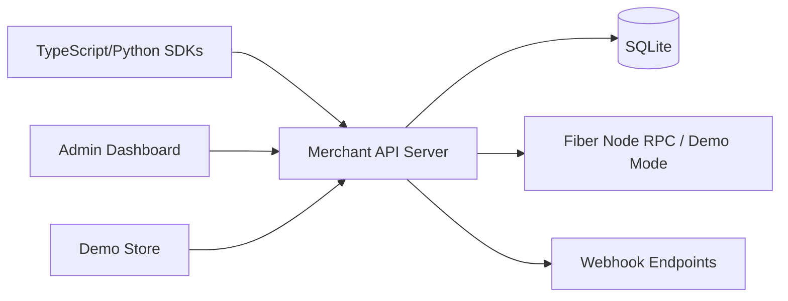

# Judge Review Guide

This file is the fastest way to evaluate Fiber Merchant Kit as a hackathon submission.

## One Sentence

Fiber Merchant Kit is merchant payment infrastructure for the Fiber Network: it turns low-level Fiber node RPC into a Stripe-style API, SDKs, webhooks, dashboard, and checkout demo.

## What To Review First

| Time | Action | Evidence |
|---|---|---|
| 2 minutes | Read this file | Product scope and judging path |
| 5 minutes | Open [docs/architecture.md](docs/architecture.md) | System boundaries, data flows, tradeoffs |
| 10 minutes | Inspect the API and webhook core | `packages/api-server/src/routes/invoices.ts`, `packages/api-server/src/services/webhook-delivery.ts` |
| 15 minutes | Run the project | API, dashboard, and demo store working together |
| 20 minutes | Inspect SDKs and dashboard | Developer integration plus merchant operation workflow |
| Optional | Run [docs/testnet-smoke.md](docs/testnet-smoke.md) | Confirms a real Fiber testnet node can answer the app's RPC adapter |

## Why This Project Exists

Fiber Network payments are powerful, but raw node RPC is not enough for merchant adoption. Merchants need:

- A stable API to create invoices and check payment status.
- Persistent transaction and invoice records.
- Webhooks for order fulfillment.
- Retry, delivery logs, and replay controls for operational reliability.
- A dashboard to see what is happening.
- SDKs for common app stacks.

This repo implements those pieces as one coherent kit.

## Architecture Snapshot



The API server is the trust boundary. It owns Fiber RPC credentials, persistence, invoice state transitions, and webhook delivery. Clients only use authenticated HTTP.

Full technical architecture: [docs/architecture.md](docs/architecture.md)

## How To Run

```bash
npm install
npm run dev
```

Or:

```bash
# macOS / Linux
./start.sh

# Windows PowerShell
.\start.ps1
```

Services:

| Service | URL | What To Check |
|---|---|---|
| API Server | http://localhost:3001 | Prints demo API key, exposes `/api/v1` |
| Admin Dashboard | http://localhost:5173 | Paste API key and inspect merchant workflows |
| Demo Store | http://localhost:5174 | Add items and run checkout |

Demo mode does not require a real Fiber node.

For a real Fiber testnet check, provide `FIBER_NODE_RPC_URL` and run:

```bash
npm run testnet:smoke
```

The read-only smoke verifies `node_info` and `list_channels`. Set `FIBER_TESTNET_CREATE_INVOICE=true` only when you want the smoke to create a testnet invoice through `new_invoice`.

## Suggested Demo Script

1. Start the repo and copy the printed `fm_sk_...` API key.
2. Open the admin dashboard.
3. Create an invoice.
4. Open invoice detail and watch status update through polling.
5. Register a webhook endpoint.
6. Send a webhook test event, inspect delivery logs, and retry a failed delivery if one is present.
7. Open the demo store and complete a checkout flow.
8. Return to dashboard and inspect invoices, transactions, and balances.

In demo mode, the store exposes a payment simulation action so judges can complete the checkout deterministically without running a real Fiber wallet.

## Implementation Evidence

| Capability | Files |
|---|---|
| API key auth | `packages/api-server/src/middleware/auth.ts` |
| Request validation | `packages/api-server/src/validation.ts` |
| Invoice lifecycle | `packages/api-server/src/routes/invoices.ts` |
| Idempotent DB transitions | `packages/api-server/src/db/index.ts` |
| Fiber RPC wrapper and demo mode | `packages/api-server/src/services/fiber-client.ts` |
| Webhook retry/signing/logs/replay | `packages/api-server/src/services/webhook-delivery.ts` |
| Webhook API and delivery log response | `packages/api-server/src/routes/webhooks.ts` |
| Dashboard workflows | `packages/admin-dashboard/src/pages` |
| Demo checkout | `packages/demo-store/src/App.tsx` |
| TypeScript SDK | `packages/sdk-typescript/src/client.ts` |
| Python SDK | `packages/sdk-python/src/fiber_merchant/client.py` |

## What Is Particularly Worth Noticing

| Area | Why It Matters |
|---|---|
| Merchant-scoped queries | Prevents one API key from reading another merchant's invoices/webhooks |
| Idempotent payment transition | Repeated invoice polling does not create duplicate successful transactions |
| Webhook delivery shape | API returns clean camelCase delivery logs instead of raw DB rows |
| Retry semantics | Non-2xx responses and network errors are both retried |
| Manual replay | Failed delivery payloads can be re-queued without mutating the original log |
| SDK base URL normalization | Users can pass either server root or `/api/v1` safely |
| Demo mode | Judges can evaluate product behavior without external blockchain setup |

## Test And Verification Commands

```bash
npm run test --workspaces --if-present
npm run lint --workspaces --if-present
npm run build --workspaces
```

During development, the project was verified with:

- API route, validation, utility, and environment tests.
- TypeScript SDK tests.
- TypeScript checks across API, SDK, dashboard, and demo store.
- Python SDK smoke test in this environment.
- Real sql.js database smoke test for invoice transition behavior.
- Fiber testnet smoke harness for `node_info`, `list_channels`, and optional `new_invoice`.

## Senior Engineering Notes

This is not just a UI demo. The system is structured around payment infrastructure concerns:

- Trust boundary: Fiber credentials stay server-side.
- Reliability: webhooks retry, record delivery attempts, and support manual replay.
- Consistency: invoice status transitions are idempotent.
- Operability: dashboard exposes invoices, transactions, balances, and webhook logs.
- Integration: SDKs are first-class, not an afterthought.
- Judge accessibility: demo mode removes external setup from the evaluation path.

## Production Path

The current architecture is intentionally hackathon-friendly and production-shaped.

| Current Choice | Production Evolution |
|---|---|
| sql.js SQLite | PostgreSQL adapter |
| In-process webhook retry | Durable queue workers and scheduling |
| Single API key auth | Merchant users, teams, RBAC |
| Poll-on-read status refresh | Background worker plus event-driven updates |
| Demo mode | Real Fiber node deployment |
| Testnet smoke | Funded multi-node settlement scenario |

## Useful Links

- [README](README.md)
- [Architecture](docs/architecture.md)
- [Getting Started](docs/getting-started.md)
- [Fiber Testnet Smoke](docs/testnet-smoke.md)
- [API Reference](docs/api-reference.md)
- [Hackathon Submission](hackathon-submission.md)
