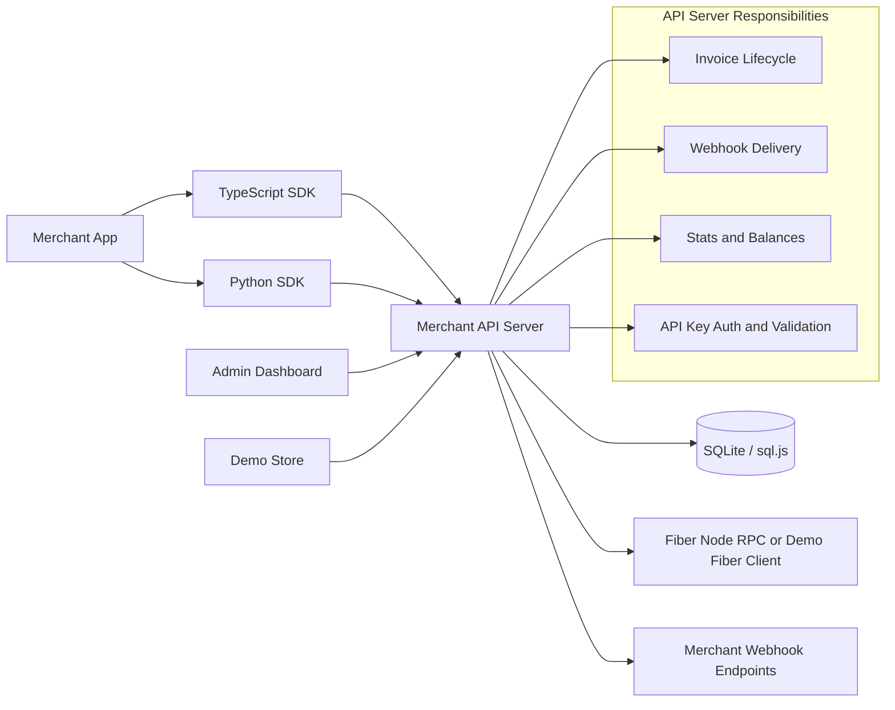

# Fiber Merchant Kit

Stripe-style merchant infrastructure for the Fiber Network: REST API, webhook delivery, admin dashboard, demo checkout, and TypeScript/Python SDKs.

This repository is organized so hackathon judges can review the product, architecture, and implementation evidence quickly.

## Judge Fast Path

| Time | What To Open | Why It Matters |
|---|---|---|
| 2 minutes | [JUDGES.md](JUDGES.md) | The fastest review path, demo script, and evidence map |
| 5 minutes | [docs/architecture.md](docs/architecture.md) | System design, data flows, boundaries, and tradeoffs |
| 10 minutes | [packages/api-server/src/routes/invoices.ts](packages/api-server/src/routes/invoices.ts) and [packages/api-server/src/services/webhook-delivery.ts](packages/api-server/src/services/webhook-delivery.ts) | Core invoice lifecycle and webhook reliability |
| 15 minutes | Run `npm run dev` | API, dashboard, and demo store running together |

## The Problem It Solves

Fiber Network gives Nervos CKB a fast payment-channel layer, but accepting payments is still too hard for normal merchants and application developers. The raw Fiber node interface is built for node operators and protocol-level integrations, not for an online store, SaaS app, game, marketplace, or wallet team that simply wants to create an invoice and fulfill an order when payment arrives.

Without a merchant layer, every team that wants to accept Fiber payments has to rebuild the same infrastructure:

| Missing Piece | Why It Blocks Adoption |
|---|---|
| Merchant-friendly invoice API | Raw node RPC requires payment-channel knowledge and does not feel like the payment APIs developers already know |
| Payment lifecycle tracking | Apps need stable states like `pending`, `paid`, `expired`, `cancelled`, and `refunded` |
| Webhook notifications | Stores and SaaS products need automatic order fulfillment when a payment settles |
| Retry and delivery logs | A webhook that fails once should not silently lose a payment event |
| Dashboard and transaction history | Merchants need to inspect invoices, payments, refunds, balances, and webhook failures |
| Multi-language SDKs | Integration should be simple from TypeScript and Python apps, not only low-level RPC clients |
| Local demo path | Judges and developers should be able to test the whole flow without running a real Fiber node |

The result is a real ecosystem gap: Fiber can move value quickly, but developers do not yet have the surrounding merchant infrastructure that turns payment channels into practical checkout flows.

## The Solution

Fiber Merchant Kit fills that gap with a Stripe-style merchant stack for Fiber Network payments. It wraps Fiber node operations behind a stable REST API, persists merchant state, handles invoice status transitions, sends signed webhooks, provides operational visibility, and ships SDKs plus a runnable demo.

| Merchant Need | Delivered In This Repo |
|---|---|
| Create payment requests | REST API and SDK invoice creation |
| Know when a payment settles | Auto-polling invoice status updates and idempotent state transitions |
| Fulfill orders automatically | HMAC-signed webhooks with retry and delivery logs |
| Debug payment operations | Dashboard views for invoices, transactions, balances, webhook logs |
| Integrate quickly | TypeScript SDK and Python SDK |
| Evaluate without infrastructure | Demo Fiber client mode and demo storefront |

In practical terms, this project lets a developer go from "I have a Fiber node" to "my app can accept, track, and react to Fiber payments" with familiar merchant primitives.

## Architecture At A Glance



The server is the trust boundary. Browser apps and SDKs never talk directly to the Fiber node. That keeps node credentials server-side, allows durable webhook delivery, and gives merchants a stable API.

Full architecture: [docs/architecture.md](docs/architecture.md)

## Repository Map

| Path | Purpose |
|---|---|
| [packages/api-server](packages/api-server) | Express API, auth, validation, SQLite persistence, Fiber RPC wrapper, webhook engine |
| [packages/admin-dashboard](packages/admin-dashboard) | Merchant operations UI built with React and Tailwind |
| [packages/demo-store](packages/demo-store) | End-to-end checkout demo that creates and polls invoices |
| [packages/sdk-typescript](packages/sdk-typescript) | Typed TypeScript SDK for merchant apps |
| [packages/sdk-python](packages/sdk-python) | Python SDK with webhook signature helper |
| [docs/api-reference.md](docs/api-reference.md) | Endpoint reference and response shapes |
| [docs/getting-started.md](docs/getting-started.md) | Local setup walkthrough |
| [docs/demo-evidence.md](docs/demo-evidence.md) | Live demo checkout evidence with paid transaction |
| [docs/testnet-smoke.md](docs/testnet-smoke.md) | Real Fiber testnet smoke path and funded settlement evidence |
| [JUDGES.md](JUDGES.md) | Hackathon review guide |

## Quick Start

Prerequisites: Node.js 18+ and npm 9+.

```bash
npm install
npm run dev
```

Or use the platform scripts:

```bash
# macOS / Linux
./start.sh

# Windows PowerShell
.\start.ps1
```

The dev command starts:

| Service | URL | Role |
|---|---|---|
| API Server | http://localhost:3001 | REST API and webhook engine |
| Admin Dashboard | http://localhost:5173 | Merchant operations UI |
| Demo Store | http://localhost:5174 | Checkout demo |

When the API server starts, copy the printed `fm_sk_...` API key and use it in the dashboard.

## Demo Flow

1. Open the dashboard and paste the demo API key.
2. Create an invoice from the dashboard.
3. Open the invoice detail page and poll/refresh status.
4. Register a webhook endpoint and send a test event.
5. Open the demo store, add products, and start checkout.
6. Use the demo payment action to complete checkout, then confirm the paid invoice in the dashboard.

Demo mode works without a real Fiber node. For testnet/production, set `FIBER_NODE_RPC_URL` plus either `FIBER_NODE_RPC_AUTH_TOKEN` for protected Fiber RPC endpoints or `FIBER_NODE_RPC_USER`/`FIBER_NODE_RPC_PASSWORD` for private basic-auth setups. See [docs/testnet-smoke.md](docs/testnet-smoke.md) for both RPC smoke checks and the July 7, 2026 funded settlement evidence.

## Core Technical Decisions

| Decision | Reason |
|---|---|
| API server as proxy | Keeps Fiber node credentials off clients and centralizes payment lifecycle logic |
| sql.js SQLite | Zero-config persistence for hackathon evaluation and simple merchant deployments |
| Opaque cursor pagination | Stable paging while preserving implementation flexibility |
| Idempotent invoice transitions | Repeated status polling should not duplicate successful transactions |
| HMAC-signed webhooks | Lets merchants verify events came from their payment server |
| Retry on non-2xx and network errors | Matches real webhook reliability expectations |
| Manual webhook replay | Lets operators retry a failed delivery from the API or dashboard |
| SDKs mirror API contracts | Judges can evaluate both direct HTTP and library integration paths |

## API Snapshot

All authenticated routes use:

```http
Authorization: Bearer fm_sk_...
```

Important endpoints:

| Endpoint | Purpose |
|---|---|
| `POST /api/v1/invoices` | Create invoice |
| `GET /api/v1/invoices/:id` | Get invoice and refresh payment status |
| `POST /api/v1/invoices/:id/simulate-payment` | Demo mode only payment confirmation |
| `POST /api/v1/invoices/:id/refund` | Refund paid invoice |
| `POST /api/v1/webhooks` | Register webhook endpoint |
| `GET /api/v1/webhooks/:id/deliveries` | Inspect delivery logs |
| `POST /api/v1/webhooks/:id/deliveries/:deliveryId/retry` | Replay a failed webhook delivery |
| `GET /api/v1/transactions` | List payment history |
| `GET /api/v1/stats` | Dashboard metrics |

Full reference: [docs/api-reference.md](docs/api-reference.md)

## SDK Examples

TypeScript:

```typescript
import { MerchantClient } from '@fiber-merchant/sdk';

const client = new MerchantClient({
  baseUrl: 'http://localhost:3001',
  apiKey: 'fm_sk_YOUR_API_KEY',
});

const invoice = await client.invoices.create({
  amount: '5000',
  currency: 'CKB',
  description: 'Order #1234',
});

const latest = await client.invoices.get(invoice.id);
```

Python:

```python
from fiber_merchant import MerchantClient, verify_webhook_signature

client = MerchantClient(
    base_url="http://localhost:3001",
    api_key="fm_sk_YOUR_API_KEY"
)

invoice = client.invoices.create(
    amount="5000",
    currency="CKB",
    description="Order #1234"
)
```

## Verification

The project includes route tests, validation tests, SDK tests, strict TypeScript checks, demo mode for end-to-end manual review, and recorded live Fiber testnet settlement evidence.

Useful commands:

```bash
npm run test --workspaces --if-present
npm run lint --workspaces --if-present
npm run build --workspaces
npm run testnet:smoke
```

The testnet smoke command requires a real FNN RPC endpoint and is documented in [docs/testnet-smoke.md](docs/testnet-smoke.md). Without that endpoint, it exits with a clear configuration error instead of pretending demo mode is a chain-backed test.

Latest smoke result: on July 7, 2026, the adapter and Merchant API passed live-mode invoice creation against a local FNN `v0.8.1` testnet node using the official config. The node connected to a bootnode peer and saw 46 graph nodes plus 98 graph channels. Payment settlement still requires a funded channel.

Latest demo checkout evidence: the local demo store completed a paid checkout and created transaction `987865e5-6d8c-47df-9d8c-ea906598a3b8`; see [docs/demo-evidence.md](docs/demo-evidence.md).

## Production Notes

Demo mode is intentionally frictionless for judging. For production:

| Area | Current State | Next Step |
|---|---|---|
| Persistence | SQLite via sql.js | PostgreSQL adapter for horizontal scale |
| Auth | API key bearer tokens | Merchant users and RBAC |
| Webhooks | Signed delivery, retry logs, and manual replay | Durable background queue |
| Fiber RPC | Current FNN RPC wrapper, bearer/basic auth, demo mode, and testnet smoke command | Node health monitoring and alerting |

## Links

- [Judge Guide](JUDGES.md)
- [Architecture](docs/architecture.md)
- [Getting Started](docs/getting-started.md)
- [Demo Evidence](docs/demo-evidence.md)
- [Fiber Testnet Smoke](docs/testnet-smoke.md)
- [API Reference](docs/api-reference.md)
- [Quick API Sheet](API.md)
