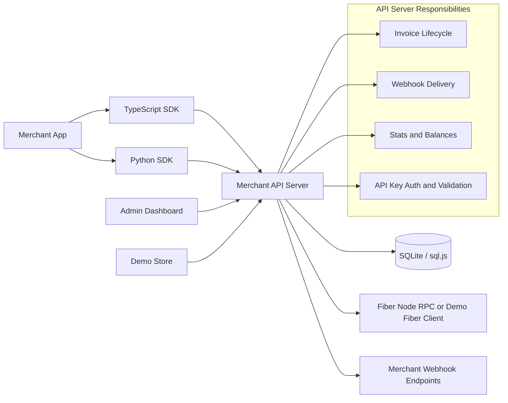

# Fiber Merchant Kit

Fiber Merchant Kit is a Stripe-style merchant layer for the Fiber Network. It lets a store, SaaS app, game, marketplace, or wallet create Fiber invoices, track settlement, send signed webhooks, inspect operations, and run a checkout demo without exposing Fiber node credentials to browsers.

## At A Glance

| Question | Answer |
|---|---|
| What is this? | Merchant payment infrastructure for Fiber Network: REST API, dashboard, demo store, webhooks, and TypeScript/Python SDKs |
| What problem does it solve? | Fiber has fast payment channels, but merchants still need familiar checkout, invoice lifecycle, fulfillment, and operational tooling |
| Who is it for? | Developers building stores, SaaS billing, games, marketplaces, wallets, and apps that want to accept Fiber payments |
| What can judges run quickly? | `npm install && npm run dev` starts the API, merchant dashboard, and keyless demo store |
| What can judges open when hosted? | [fiber-merchant-kit-zynorr.fly.dev](https://fiber-merchant-kit-zynorr.fly.dev) serves the API, dashboard at `/dashboard`, and FiberStore at `/store` from one URL |
| What proves live-network readiness? | [docs/testnet-smoke.md](docs/testnet-smoke.md) records real FNN testnet smoke checks plus funded settlement evidence |

## Judge Fast Path

| Time | Do This | You Should See |
|---|---|---|
| 2 minutes | Read [JUDGES.md](JUDGES.md) | Product thesis, demo script, and evidence map |
| 5 minutes | Skim [docs/architecture.md](docs/architecture.md) | Trust boundary, invoice flow, webhook flow, and Fiber RPC integration |
| 8 minutes | Run `npm install && npm run dev` | API on `3001`, dashboard on `5173`, demo store on `5174` |
| 12 minutes | Complete demo-store checkout | A shopper-safe checkout that does not ask for a merchant API key |
| 15 minutes | Inspect dashboard invoices, webhooks, network, and stats | Merchant operations around invoice lifecycle and fulfillment |
| Hosted | Open [the Fly demo](https://fiber-merchant-kit-zynorr.fly.dev) | One public URL with `/dashboard` and `/store`; the hosted dashboard can use the built-in demo key helper |
| Optional | Run [docs/testnet-smoke.md](docs/testnet-smoke.md) | Real FNN RPC readiness and recorded funded Fiber testnet settlement |

## The Problem It Solves

Fiber Network gives Nervos CKB a fast payment-channel layer, but raw Fiber node RPC is not a merchant product. A normal application team does not want to teach its checkout page about channel state, payment hashes, node credentials, webhook retries, or manual settlement checks. It wants the primitives every production payment integration expects: create an invoice, show a payment request, know when it is paid, fulfill the order, and debug failures.

Without a merchant layer, every Fiber payment integration has to rebuild the same missing pieces:

| Missing Piece | Why It Blocks Adoption |
|---|---|
| Merchant-friendly invoice API | Raw node RPC is protocol-facing, not shaped like familiar payment APIs |
| Stable payment lifecycle | Apps need clear states such as `pending`, `paid`, `expired`, `cancelled`, and `refunded` |
| Shopper-safe checkout | Browsers should never receive merchant API keys or Fiber node credentials |
| Webhook fulfillment | Stores and SaaS products need automatic order fulfillment after settlement |
| Retry and delivery logs | A failed webhook must be visible, retried, and replayable |
| Dashboard and transaction history | Merchants need to inspect invoices, balances, payments, refunds, network status, and failures |
| SDKs and examples | Integration should be simple from TypeScript and Python apps |
| Local review path | Judges and developers should be able to test the workflow without running a funded Fiber node |

## The Solution

Fiber Merchant Kit wraps Fiber node operations behind a stable Merchant API, persists merchant state, handles invoice transitions, sends HMAC-signed webhooks, exposes a dashboard, and ships SDKs plus a runnable demo store.

| Merchant Need | Delivered In This Repo |
|---|---|
| Create payment requests | REST API, SDK invoice creation, and server-side demo-store checkout |
| Know when payment settles | Invoice polling, background settlement worker, and idempotent state transitions |
| Fulfill orders automatically | Signed webhooks with retry, delivery logs, queue status, and manual replay |
| Debug operations | Dashboard views for invoices, transactions, balances, webhook logs, and Fiber node status |
| Integrate quickly | TypeScript SDK, Python SDK, OpenAPI contract, and examples |
| Evaluate safely | Demo Fiber client mode plus documented real FNN testnet smoke path |

In practical terms, this project turns "I have a Fiber node" into "my app can accept, track, and react to Fiber payments" with familiar merchant primitives.

## Architecture At A Glance



The server is the trust boundary. Browser apps and SDKs never talk directly to the Fiber node. That keeps node credentials server-side, allows durable webhook delivery, and gives merchants a stable API.

Full architecture: [docs/architecture.md](docs/architecture.md)

## Repository Map

| Path | Purpose |
|---|---|
| [packages/api-server](packages/api-server) | Express API, auth, validation, SQLite persistence, Fiber RPC wrapper, webhook engine |
| [packages/admin-dashboard](packages/admin-dashboard) | Merchant operations UI built with React and Tailwind |
| [packages/demo-store](packages/demo-store) | End-to-end checkout demo that creates and polls invoices |
| [packages/sdk-typescript](packages/sdk-typescript) | Typed TypeScript SDK for merchant apps |
| [packages/sdk-python](packages/sdk-python) | Python SDK with webhook signature helper |
| [docs/api-reference.md](docs/api-reference.md) | Endpoint reference and response shapes |
| [docs/openapi.json](docs/openapi.json) | Machine-readable OpenAPI 3.0 contract for the Merchant API |
| [docs/getting-started.md](docs/getting-started.md) | Local setup walkthrough |
| [docs/deployment.md](docs/deployment.md) | Docker, production env, failover, PostgreSQL, and CI-validated container deployment notes |
| [docs/demo-evidence.md](docs/demo-evidence.md) | Live demo checkout evidence with paid transaction |
| [docs/testnet-smoke.md](docs/testnet-smoke.md) | Real Fiber testnet smoke path and funded settlement evidence |
| [JUDGES.md](JUDGES.md) | Hackathon review guide |

## Quick Start

Prerequisites: Node.js 18+ and npm 9+.

```bash
npm install
npm run dev
```

Or use the platform scripts:

```bash
# macOS / Linux
./start.sh

# Windows PowerShell
.\start.ps1
```

The root dev command starts all judge-facing services:

| Service | URL | Role |
|---|---|---|
| API Server | http://localhost:3001 | Browser-friendly server index, REST API, and webhook engine |
| Admin Dashboard | http://localhost:5173 | Merchant operations UI |
| Demo Store | http://localhost:5174 | Keyless shopper checkout demo |

In a Docker or Fly deployment, the same API process also serves the built UIs at `/dashboard` and `/store`, so judges can review the full demo from one public origin. The current hosted judge demo is [https://fiber-merchant-kit-zynorr.fly.dev](https://fiber-merchant-kit-zynorr.fly.dev).

Environment templates are checked in at [.env.example](.env.example) and under each package. The platform scripts copy package templates to `.env` files and load `packages/api-server/.env`; direct `npm run dev` users can export the same variables in their shell.

If one of the default ports is already in use, stop the old local process first or run the affected workspace with a custom port. For the API, use `PORT=3002 npm run dev --workspace=packages/api-server` on macOS/Linux or `$env:PORT=3002; npm run dev --workspace=packages/api-server` in Windows PowerShell. For Vite apps, use `npm run dev --workspace=packages/admin-dashboard -- --port 5175` or `npm run dev --workspace=packages/demo-store -- --port 5176`.

## API Keys In The Demo

| Surface | Needs `fm_sk_...`? | Why |
|---|---:|---|
| Admin dashboard | Yes | It is the merchant back office and uses authenticated API routes |
| TypeScript/Python SDKs | Yes | They act as a merchant backend integration |
| Demo Store / FiberStore shopper checkout | No | Checkout calls a public server-side demo route so shoppers never see the merchant key |

When running locally, copy the latest printed `Demo Merchant API Key: fm_sk_...` value from the API server logs and paste it into the dashboard. On the hosted Fly judge demo, the dashboard shows a `Use demo key` button because that deployment explicitly sets `EXPOSE_DEMO_KEY=true` while staying in demo mode. If the dashboard says the key is invalid, the API server was probably restarted and minted a new demo key; copy the latest one from the server logs or use the hosted demo helper again.

## Demo Data

Local demo state is stored in `packages/api-server/data/merchant.db`. The file is generated at runtime, ignored by git, and safe to delete when you want a fresh judge run:

```bash
npm run demo:reset
```

The next API start recreates the database and prints a fresh demo API key.

## Local Demo Flow

1. Start the repo with `npm run dev`.
2. Open http://localhost:3001 and confirm the server index, API discovery, and health links.
3. Open http://localhost:5173, paste the `fm_sk_...` key from the API logs, and create an invoice.
4. Open the invoice detail page and refresh/poll status.
5. Inspect the Network page for Fiber node, channel, endpoint, and settlement worker status.
6. Register a webhook endpoint, send a test event, inspect delivery logs, and replay a failed delivery if present.
7. Open http://localhost:5174, add products, and start checkout without entering a merchant API key.
8. In demo mode, use the payment simulation action to mark the checkout paid, then confirm the paid invoice and transaction in the dashboard.

## Demo Mode vs Live FNN Testnet

| Mode | What It Proves | What You Need |
|---|---|---|
| Demo mode | Merchant UX, invoice lifecycle, signed webhooks, transactions, stats, and checkout fulfillment | Node.js and npm only |
| Live FNN testnet smoke | The API can talk to a real Fiber node and create real testnet invoices | `FIBER_NODE_RPC_URL`, `FIBER_NODE_CURRENCY=Fibt`, and optional RPC auth |
| Funded settlement | A real Fiber payment can route and settle | A separate funded payer node/channel; invoice creation alone is not enough |

For testnet or production, set `FIBER_NODE_RPC_URL` or comma-separated `FIBER_NODE_RPC_URLS` plus either `FIBER_NODE_RPC_AUTH_TOKEN` for protected Fiber RPC endpoints or `FIBER_NODE_RPC_USER`/`FIBER_NODE_RPC_PASSWORD` for private basic-auth setups. See [docs/testnet-smoke.md](docs/testnet-smoke.md) for RPC smoke checks and [docs/deployment.md](docs/deployment.md) for Docker/failover notes.

## Core Technical Decisions

| Decision | Reason |
|---|---|
| API server as proxy | Keeps Fiber node credentials off clients and centralizes payment lifecycle logic |
| sql.js SQLite | Zero-config persistence for hackathon evaluation and simple merchant deployments |
| Opaque cursor pagination | Stable paging while preserving implementation flexibility |
| Idempotency keys for invoice creation | Duplicate checkout submits return the original invoice instead of creating a second payment request |
| Idempotent invoice transitions | Repeated status polling should not duplicate successful transactions |
| HMAC-signed webhooks | Lets merchants verify events came from their payment server |
| Durable webhook outbox | Failed delivery attempts keep retry timing in SQLite so events resume after restart |
| Dashboard queue visibility | Operators can inspect queued/rescheduled/exhausted deliveries and run one worker tick |
| Retry on non-2xx and network errors | Matches real webhook reliability expectations |
| Manual webhook replay | Lets operators retry a failed delivery from the API or dashboard |
| API-key role metadata | Provides a small RBAC foundation for key rotation and future merchant teams |
| Fiber RPC failover list | Lets live deployments configure multiple FNN endpoints without exposing credentials |
| Background settlement worker | Live-mode invoices reconcile even when nobody is viewing the invoice page |
| SDKs mirror API contracts | Judges can evaluate both direct HTTP and library integration paths |

## API Snapshot

All authenticated routes use:

```http
Authorization: Bearer fm_sk_...
```

Important endpoints:

| Endpoint | Purpose |
|---|---|
| `GET /` | Public server index for judges and local operators |
| `GET /api/v1` | Public API discovery metadata |
| `GET /api/v1/health` | Public health check with Fiber node reachability |
| `GET /api/v1/demo-store/demo-key` | Hosted demo mode only: temporary dashboard key helper for judges |
| `POST /api/v1/demo-store/checkout` | Public demo-store checkout that creates server-side invoices without exposing a merchant API key |
| `GET /api/v1/demo-store/invoices/:id` | Public demo-store invoice polling route |
| `GET /api/v1/auth/me` | Inspect authenticated merchant role and permissions |
| `POST /api/v1/auth/api-key/rotate` | Rotate the current merchant API key |
| `POST /api/v1/invoices` | Create invoice |
| `GET /api/v1/invoices/:id` | Get invoice and refresh payment status |
| `POST /api/v1/invoices/:id/simulate-payment` | Demo mode only payment confirmation |
| `POST /api/v1/invoices/:id/refund` | Refund paid invoice |
| `POST /api/v1/webhooks` | Register webhook endpoint |
| `GET /api/v1/webhooks/:id/deliveries` | Inspect delivery logs |
| `POST /api/v1/webhooks/:id/deliveries/:deliveryId/retry` | Replay a failed webhook delivery |
| `GET /api/v1/webhooks/delivery-worker/status` | Inspect webhook queue worker status |
| `POST /api/v1/webhooks/delivery-worker/run` | Run one webhook queue tick immediately |
| `GET /api/v1/transactions` | List payment history |
| `GET /api/v1/stats` | Dashboard metrics |
| `GET /api/v1/fiber/status` | Fiber node, channel, and settlement worker status |
| `POST /api/v1/fiber/settlement/run` | Trigger an immediate open-invoice settlement sweep |

Full reference: [docs/api-reference.md](docs/api-reference.md). Machine-readable contract: [docs/openapi.json](docs/openapi.json).

## SDK Examples

TypeScript:

```typescript
import { MerchantClient, verifyWebhookSignature } from '@fiber-merchant/sdk';

const client = new MerchantClient({
  baseUrl: 'http://localhost:3001',
  apiKey: 'fm_sk_YOUR_API_KEY',
});

const invoice = await client.invoices.create({
  amount: '5000',
  currency: 'CKB',
  description: 'Order #1234',
}, { idempotencyKey: 'order_1234' });

const latest = await client.invoices.get(invoice.id);
const fiberStatus = await client.fiber.getStatus();
const settlementRun = await client.fiber.runSettlement();

// In your webhook route, verify the raw request body first.
const valid = await verifyWebhookSignature(rawBody, signatureHeader, 'whsec_YOUR_SECRET');
```

Python:

```python
from fiber_merchant import MerchantClient, verify_webhook_signature

client = MerchantClient(
    base_url="http://localhost:3001",
    api_key="fm_sk_YOUR_API_KEY"
)

invoice = client.invoices.create(
    amount="5000",
    currency="CKB",
    description="Order #1234"
)
```

## Verification

The project includes route tests, validation tests, SDK tests, strict TypeScript checks, demo mode for end-to-end manual review, and recorded live Fiber testnet settlement evidence.

Useful commands:

| Command | What It Verifies |
|---|---|
| `npm run judge:verify` | One-command judge check: demo smoke, tests, lint/type checks, and workspace builds |
| `npm run demo:smoke` | Local end-to-end API, invoice, signed webhook, simulated payment, stats, and settlement sweep |
| `npm run demo:reset` | Removes local generated demo DB state before a fresh manual run |
| `npm run test --workspaces --if-present` | Unit and route tests across workspaces |
| `npm run lint --workspaces --if-present` | Lint checks |
| `npm run build --workspaces` | TypeScript builds for API, SDK, dashboard, and demo store |
| `npm run testnet:smoke` | Real FNN RPC smoke path when `FIBER_NODE_RPC_URL` is configured |
| `docker compose --profile postgres config` | Production Compose configuration, including PostgreSQL profile |
| `docker build --target api -t fiber-merchant-kit-api:local .` | Production API Docker image build |

`npm run demo:smoke` starts the API in isolated demo mode with a temporary SQLite database and local webhook receiver. It verifies the public index, health endpoint, invoice creation, HMAC-signed webhooks, demo payment simulation, transaction recording, stats, and manual settlement sweep.

The testnet smoke command requires a real FNN RPC endpoint and is documented in [docs/testnet-smoke.md](docs/testnet-smoke.md). Without that endpoint, it exits with a clear configuration error instead of pretending demo mode is a chain-backed test.

GitHub Actions also validates the production Compose file, including the PostgreSQL profile, and builds the production API Docker image from `Dockerfile`.

Latest smoke result: on July 8, 2026, the demo store was redeployed against a disposable local FNN `v0.8.1` testnet node and created keyless live invoice `db6529e2-efe0-4451-84d5-7a4746585688` with payment hash `263221c4e16d2e005ed0b3a7dbabf38c85cf7f3df0f5b9856b203d633f64f52b`. The same evidence file includes the July 7 funded live Fiber testnet settlement: public `ChannelReady` channels, faucet funding transactions, and payment hash `0xe28512a5139dcd8ce648d6ab8e2a6924f4ce1f64d1ce52a45212689dca859864` with status `Success`.

Latest demo checkout evidence: the local demo store completed a paid checkout and created transaction `987865e5-6d8c-47df-9d8c-ea906598a3b8`; see [docs/demo-evidence.md](docs/demo-evidence.md).

## Production Notes

Demo mode is intentionally frictionless for judging. For production:

| Area | Current State | Next Step |
|---|---|---|
| Persistence | SQLite via sql.js | PostgreSQL adapter for horizontal scale |
| Auth | API key bearer tokens with role metadata and key rotation | Full merchant users, teams, and audit logs |
| Webhooks | Signed delivery, SQLite outbox retries, retry logs, manual replay, queue status, and manual worker run | External queue workers for horizontal scale |
| Fiber RPC | Current FNN RPC wrapper, bearer/basic auth, failover URLs, demo mode, status endpoint, and testnet smoke command | Node health alerting and automated failover policy |
| Deployment | API Dockerfile, Compose, production env template, PostgreSQL schema | Managed database and hosted dashboard |

## Links

- [Judge Guide](JUDGES.md)
- [Architecture](docs/architecture.md)
- [Getting Started](docs/getting-started.md)
- [Deployment Notes](docs/deployment.md)
- [Demo Evidence](docs/demo-evidence.md)
- [Fiber Testnet Smoke](docs/testnet-smoke.md)
- [API Reference](docs/api-reference.md)
- [OpenAPI Contract](docs/openapi.json)
- [Quick API Sheet](API.md)
