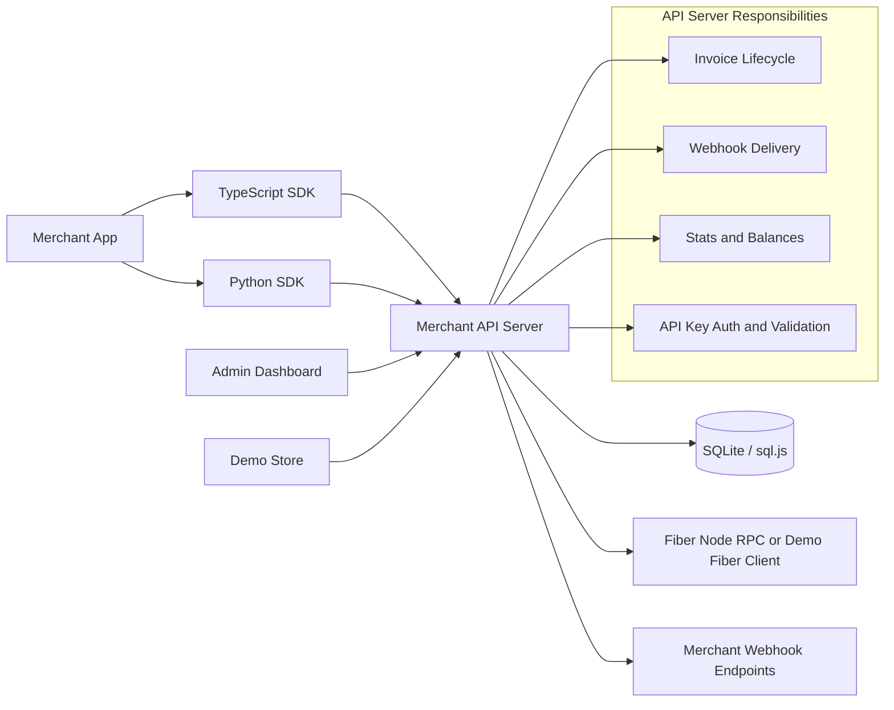

# Fiber Merchant Kit

Stripe-style merchant infrastructure for the Fiber Network: REST API, webhook delivery, admin dashboard, demo checkout, and TypeScript/Python SDKs.

This repository is organized so hackathon judges can review the product, architecture, and implementation evidence quickly.

## Judge Fast Path

| Time | What To Open | Why It Matters |
|---|---|---|
| 2 minutes | [JUDGES.md](JUDGES.md) | The fastest review path, demo script, and evidence map |
| 5 minutes | [docs/architecture.md](docs/architecture.md) | System design, data flows, boundaries, and tradeoffs |
| 10 minutes | [packages/api-server/src/routes/invoices.ts](packages/api-server/src/routes/invoices.ts) and [packages/api-server/src/services/webhook-delivery.ts](packages/api-server/src/services/webhook-delivery.ts) | Core invoice lifecycle and webhook reliability |
| 15 minutes | Run `npm run dev` | API, dashboard, and demo store running together |

## What This Solves

Fiber Network is fast and low-cost, but raw Fiber node RPC is not merchant-friendly. A merchant would still need invoice lifecycle handling, payment polling, webhooks, retries, a dashboard, SDKs, and persistence.

Fiber Merchant Kit packages those missing pieces into one developer-facing system.

| Merchant Need | Delivered In This Repo |
|---|---|
| Create payment requests | REST API and SDK invoice creation |
| Know when a payment settles | Auto-polling invoice status updates |
| Integrate into order systems | HMAC-signed webhooks with retry and delivery logs |
| Operate the system | React admin dashboard for invoices, webhooks, transactions, balances |
| Demo without node setup | Built-in demo Fiber client mode |
| Integrate from apps | TypeScript SDK and Python SDK |

## Architecture At A Glance



The server is the trust boundary. Browser apps and SDKs never talk directly to the Fiber node. That keeps node credentials server-side, allows durable webhook delivery, and gives merchants a stable API.

Full architecture: [docs/architecture.md](docs/architecture.md)

## Repository Map

| Path | Purpose |
|---|---|
| [packages/api-server](packages/api-server) | Express API, auth, validation, SQLite persistence, Fiber RPC wrapper, webhook engine |
| [packages/admin-dashboard](packages/admin-dashboard) | Merchant operations UI built with React and Tailwind |
| [packages/demo-store](packages/demo-store) | End-to-end checkout demo that creates and polls invoices |
| [packages/sdk-typescript](packages/sdk-typescript) | Typed TypeScript SDK for merchant apps |
| [packages/sdk-python](packages/sdk-python) | Python SDK with webhook signature helper |
| [docs/api-reference.md](docs/api-reference.md) | Endpoint reference and response shapes |
| [docs/getting-started.md](docs/getting-started.md) | Local setup walkthrough |
| [JUDGES.md](JUDGES.md) | Hackathon review guide |

## Quick Start

Prerequisites: Node.js 18+ and npm 9+.

```bash
npm install
npm run dev
```

Or use the platform scripts:

```bash
# macOS / Linux
./start.sh

# Windows PowerShell
.\start.ps1
```

The dev command starts:

| Service | URL | Role |
|---|---|---|
| API Server | http://localhost:3001 | REST API and webhook engine |
| Admin Dashboard | http://localhost:5173 | Merchant operations UI |
| Demo Store | http://localhost:5174 | Checkout demo |

When the API server starts, copy the printed `fm_sk_...` API key and use it in the dashboard.

## Demo Flow

1. Open the dashboard and paste the demo API key.
2. Create an invoice from the dashboard.
3. Open the invoice detail page and poll/refresh status.
4. Register a webhook endpoint and send a test event.
5. Open the demo store, add products, and start checkout.
6. Watch the invoice move through pending, paid, expired, or cancelled states.

Demo mode works without a real Fiber node. In production, set `FIBER_NODE_RPC_URL`, `FIBER_NODE_RPC_USER`, and `FIBER_NODE_RPC_PASSWORD`.

## Core Technical Decisions

| Decision | Reason |
|---|---|
| API server as proxy | Keeps Fiber node credentials off clients and centralizes payment lifecycle logic |
| sql.js SQLite | Zero-config persistence for hackathon evaluation and simple merchant deployments |
| Opaque cursor pagination | Stable paging while preserving implementation flexibility |
| Idempotent invoice transitions | Repeated status polling should not duplicate successful transactions |
| HMAC-signed webhooks | Lets merchants verify events came from their payment server |
| Retry on non-2xx and network errors | Matches real webhook reliability expectations |
| SDKs mirror API contracts | Judges can evaluate both direct HTTP and library integration paths |

## API Snapshot

All authenticated routes use:

```http
Authorization: Bearer fm_sk_...
```

Important endpoints:

| Endpoint | Purpose |
|---|---|
| `POST /api/v1/invoices` | Create invoice |
| `GET /api/v1/invoices/:id` | Get invoice and refresh payment status |
| `POST /api/v1/invoices/:id/refund` | Refund paid invoice |
| `POST /api/v1/webhooks` | Register webhook endpoint |
| `GET /api/v1/webhooks/:id/deliveries` | Inspect delivery logs |
| `GET /api/v1/transactions` | List payment history |
| `GET /api/v1/stats` | Dashboard metrics |

Full reference: [docs/api-reference.md](docs/api-reference.md)

## SDK Examples

TypeScript:

```typescript
import { MerchantClient } from '@fiber-merchant/sdk';

const client = new MerchantClient({
  baseUrl: 'http://localhost:3001',
  apiKey: 'fm_sk_YOUR_API_KEY',
});

const invoice = await client.invoices.create({
  amount: '5000',
  currency: 'CKB',
  description: 'Order #1234',
});

const latest = await client.invoices.get(invoice.id);
```

Python:

```python
from fiber_merchant import MerchantClient, verify_webhook_signature

client = MerchantClient(
    base_url="http://localhost:3001",
    api_key="fm_sk_YOUR_API_KEY"
)

invoice = client.invoices.create(
    amount="5000",
    currency="CKB",
    description="Order #1234"
)
```

## Verification

The project includes route tests, validation tests, SDK tests, strict TypeScript checks, and a demo mode for end-to-end manual review.

Useful commands:

```bash
npm run test --workspaces --if-present
npm run lint --workspaces --if-present
npm run build --workspaces
```

## Production Notes

Demo mode is intentionally frictionless for judging. For production:

| Area | Current State | Next Step |
|---|---|---|
| Persistence | SQLite via sql.js | PostgreSQL adapter for horizontal scale |
| Auth | API key bearer tokens | Merchant users and RBAC |
| Webhooks | Signed delivery with retry logs | Background queue and dashboard replay |
| Fiber RPC | Real RPC wrapper plus demo mode | Node health monitoring and alerting |

## Links

- [Judge Guide](JUDGES.md)
- [Architecture](docs/architecture.md)
- [Getting Started](docs/getting-started.md)
- [API Reference](docs/api-reference.md)
- [Quick API Sheet](API.md)
