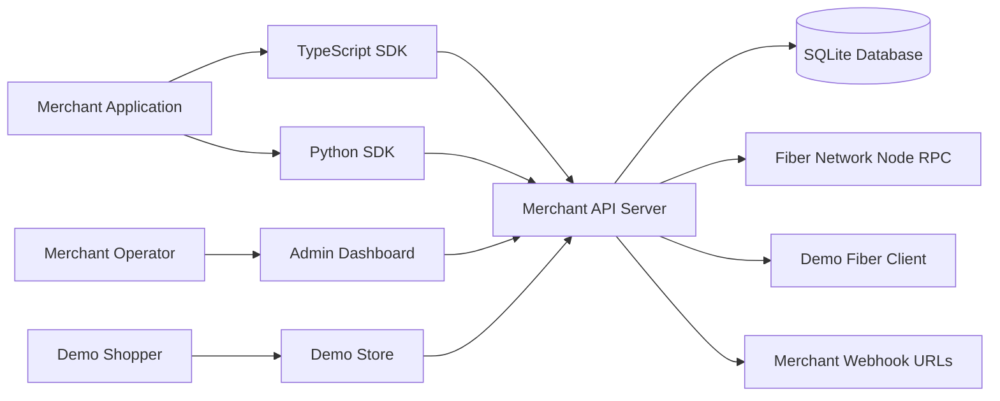
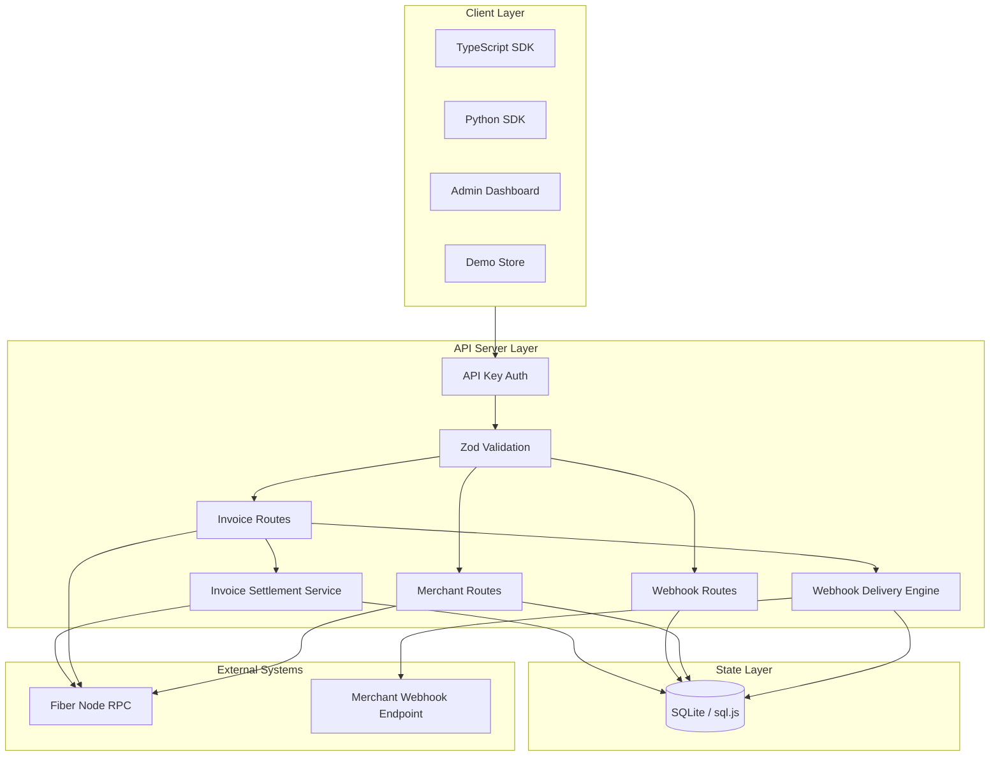
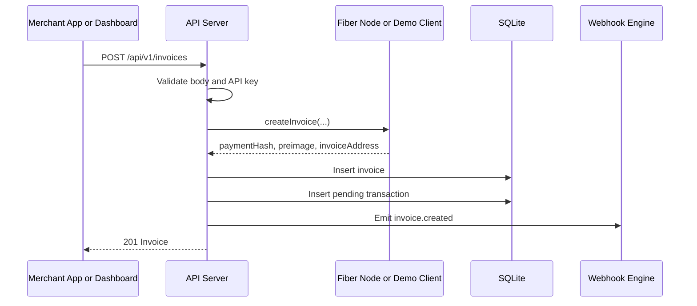
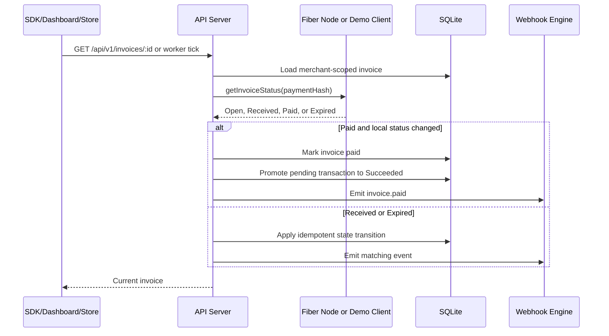
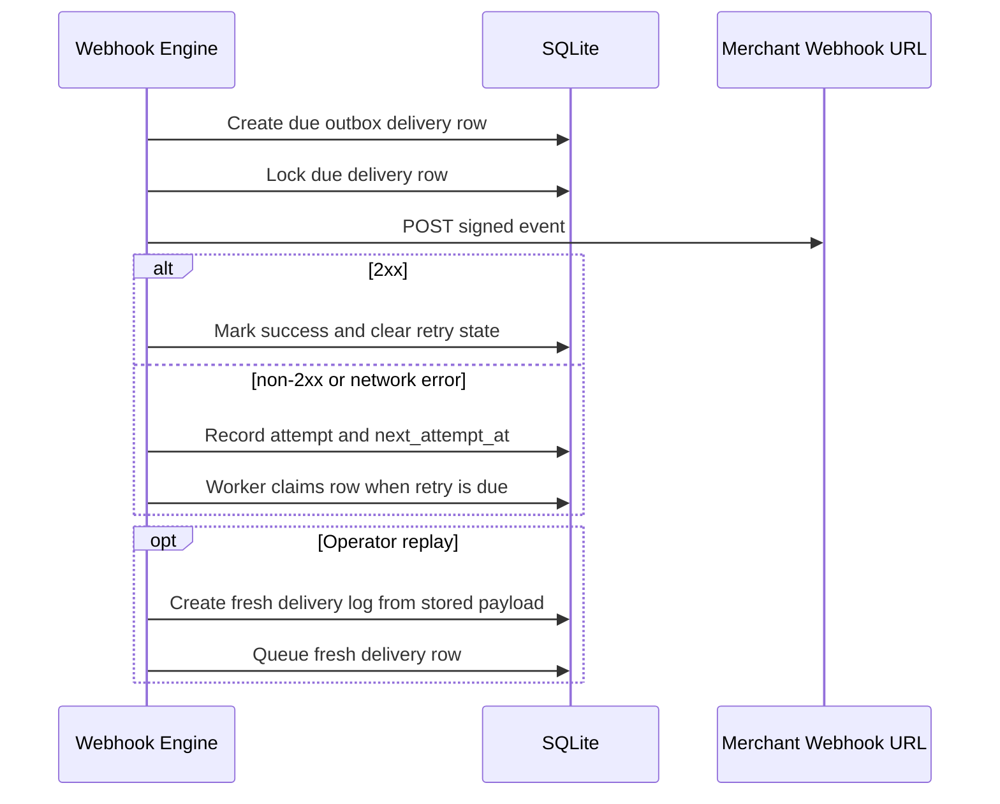

# Fiber Merchant Kit Architecture

This document is written for reviewers who need to understand the system quickly and then inspect the implementation with confidence.

## Executive Summary

Fiber Merchant Kit turns low-level Fiber Network Node RPC into merchant-grade payment infrastructure:

- A REST API for invoices, refunds, transactions, channel balances, stats, and webhooks.
- A durable local database for merchant state.
- A webhook delivery engine with HMAC signatures, SQLite-backed retry state, delivery logs, and manual replay.
- A live-mode settlement worker plus admin network status view for operating real Fiber nodes.
- Admin and demo frontends for operating and demonstrating the flow.
- TypeScript and Python SDKs for application integration.

The important design choice is the API server boundary. It owns secrets, persistence, Fiber RPC access, invoice state transitions, and webhook delivery. Clients stay simple and safe.

## System Context

### Runtime Ports

| Runtime | Default URL | Package |
|---|---|---|
| API Server | `http://localhost:3001` | `packages/api-server` |
| Admin Dashboard | `http://localhost:5173` | `packages/admin-dashboard` |
| Demo Store | `http://localhost:5174` | `packages/demo-store` |

## Component Responsibilities

| Component | Owns | Does Not Own | Key Files |
|---|---|---|---|
| API Server | Auth, validation, invoice lifecycle, DB writes, Fiber RPC calls, settlement worker, webhook dispatch | Browser UI state | `packages/api-server/src/routes/*`, `packages/api-server/src/db/index.ts`, `packages/api-server/src/services/invoice-settlement.ts`, `packages/api-server/src/services/webhook-delivery.ts` |
| SQLite Layer | Merchant, invoice, webhook, delivery, transaction persistence | Business decisions outside DB helpers | `packages/api-server/src/db/schema.ts`, `packages/api-server/src/db/index.ts` |
| Fiber Client | Fiber node RPC abstraction and demo-mode simulation | Merchant auth or webhooks | `packages/api-server/src/services/fiber-client.ts`, `packages/api-server/src/lib/fiber-client.ts` |
| Admin Dashboard | Merchant operations workflow | Payment truth or secret storage | `packages/admin-dashboard/src/pages/*` |
| Demo Store | Buyer-facing checkout demo | Merchant administration | `packages/demo-store/src/App.tsx` |
| TypeScript SDK | Typed API access for JS apps | Persistence or background jobs | `packages/sdk-typescript/src/client.ts` |
| Python SDK | Python API access and webhook signature helper | Persistence or background jobs | `packages/sdk-python/src/fiber_merchant/client.py` |

## Layered Architecture

## Main Data Flows

### 1. Create Invoice

Why this matters: merchants get one simple REST call while the server handles Fiber RPC details and records the invoice locally.

### 2. Refresh Invoice Status And Worker Reconciliation

Why this matters: status refresh is idempotent and reusable. User reads, dashboard polling, and the live-mode background worker all use the same settlement path, so repeated reconciliation does not create duplicate successful transactions.

### 3. Deliver Webhook

Why this matters: webhook failures are visible, retried, and replayable. The dashboard can show delivery attempts and errors without losing the original audit trail.

## State Model

| Table | Purpose |
|---|---|
| `merchants` | API key identity and merchant metadata |
| `invoices` | Payment requests, Fiber payment hash, invoice address, status timestamps |
| `transactions` | Incoming/outgoing payment history connected to invoices |
| `webhooks` | Registered merchant webhook endpoints and event subscriptions |
| `webhook_deliveries` | Delivery attempts, HTTP status, success flag, error, payload, retry timing, and lock state |
| `idempotency_keys` | Replay records for duplicate mutation requests such as checkout invoice creation |

## API Contract Shape

Database rows are snake_case internally. API responses are camelCase externally.

| Internal | External |
|---|---|
| `payment_hash` | `paymentHash` |
| `invoice_address` | `invoiceAddress` |
| `created_at` | `createdAt` |
| `delivered_at` | `deliveredAt` |

This keeps SQLite simple while giving JS and Python clients a predictable public contract.

## Security Model

| Concern | Design |
|---|---|
| API access | Bearer API keys with `fm_sk_` prefix |
| Fiber RPC credentials | Server-side only, never exposed to dashboard/store |
| Request validation | Zod schemas at route boundaries |
| Webhook authenticity | HMAC-SHA256 signature in `X-Fiber-Signature` |
| Tenant isolation | Merchant-scoped invoice, webhook, transaction, and delivery queries |
| Abuse control | Express rate limiting middleware |
| Browser security | Helmet and configurable CORS |

## Reliability Decisions

| Decision | Reason |
|---|---|
| Idempotent invoice state updates | Polling is repeated by nature; repeated reads must not duplicate writes |
| Idempotency key conflict detection | Reused checkout keys must match the original request body before replaying an invoice |
| Promote pending incoming transaction | Keeps one canonical transaction for one invoice payment |
| SQLite-backed webhook outbox | Failed webhook attempts survive process restarts and can be resumed by the worker |
| Retry webhook non-2xx responses | HTTP 500 is a delivery failure, not a successful attempt |
| Replay webhook deliveries as new rows | Operators need a clean audit trail when re-sending a failed event |
| Background settlement worker | Live-mode invoices can settle without a user opening each invoice |
| Opaque cursor pagination | Allows stable created-at/id ordering without exposing implementation details |
| Demo Fiber client | Judges can review the full product without running a Fiber node |

## Demo Mode vs Production Mode

| Capability | Demo Mode | Production Mode |
|---|---|---|
| Fiber RPC | Simulated in process | Real `FIBER_NODE_RPC_URL` |
| Invoice creation | Fake payment hashes and addresses | Fiber node invoice RPC |
| Payment status | Randomized status simulation | Fiber node status polling |
| Channels | Sample balances | Real channel list |
| Settlement worker | Disabled by default | Enabled by default when a real Fiber RPC URL is configured |
| Network status | Demo node and sample channels | Real node, channel, and worker status |
| Setup cost | No external services | Fiber node credentials required |

Production/testnet RPC configuration supports current FNN JSON-RPC method names, Biscuit bearer auth via `FIBER_NODE_RPC_AUTH_TOKEN`, private basic auth as a fallback, and a repeatable smoke command documented in [testnet-smoke.md](testnet-smoke.md).

## Review Checklist

Judges can inspect these files to validate the architecture:

| Question | Where To Look |
|---|---|
| How is authentication enforced? | `packages/api-server/src/middleware/auth.ts` |
| How are invoice state transitions handled? | `packages/api-server/src/services/invoice-settlement.ts`, `packages/api-server/src/db/index.ts` |
| How does background reconciliation run? | `packages/api-server/src/services/settlement-worker.ts`, `packages/api-server/src/index.ts` |
| How are webhook retries implemented? | `packages/api-server/src/services/webhook-delivery.ts` |
| How are API inputs validated? | `packages/api-server/src/validation.ts` |
| How do we smoke-test a real Fiber testnet node? | `docs/testnet-smoke.md`, `packages/api-server/src/scripts/testnet-smoke.ts` |
| How do SDKs map to API endpoints? | `packages/sdk-typescript/src/client.ts`, `packages/sdk-python/src/fiber_merchant/client.py` |
| How does the dashboard expose merchant workflows? | `packages/admin-dashboard/src/pages` |
| How does the demo store exercise checkout? | `packages/demo-store/src/App.tsx` |

## Known Tradeoffs

| Tradeoff | Why It Was Acceptable For Hackathon | Production Path |
|---|---|---|
| SQLite/sql.js instead of hosted DB | Zero-config setup and easy judging | PostgreSQL adapter |
| In-process settlement worker | Easy to inspect and enough for one API server | Durable queue worker for multi-instance deployments |
| SQLite webhook outbox with in-process worker | Easy to inspect and enough for one API server | External queue workers and scheduling for multi-instance deployments |
| Single API key auth model | Fits demo merchant workflow | Merchant users, teams, RBAC |
| Demo Fiber client | Makes the project runnable by anyone | Real Fiber node deployment |

## Why This Architecture Fits The Problem

Payment infrastructure needs more than a single RPC wrapper. It needs a reliable boundary between merchant apps and payment network operations. This architecture puts that boundary in the API server, then builds the merchant experience around it: SDKs for integration, dashboard for operation, demo store for proof, and webhooks for automation.
